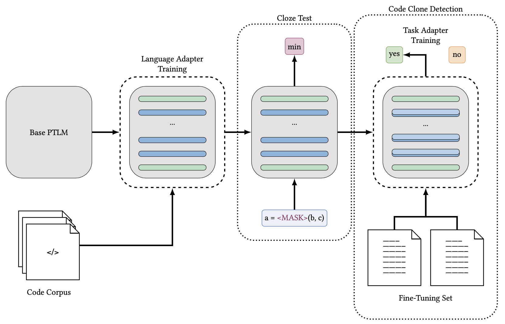

# MODE-X

This repo provides the code for reproducing the experiments in [On The Cross-Modal Transfer from Natural Language to Code through Adapter Modules](arXiv_link). We explored the bimodality of adapter modules to facilitate cross-modal transfer from large pre-trained neural language models to other language modalities, i.e. source code. Specifically, we trained adapters on three programming languages (Python, Java and C/C++) for the pre-trained [RoBERTa](https://huggingface.co/docs/transformers/model_doc/roberta#transformers.RobertaConfig) language model, and tested them on the downstream task of Code Clone Detection. We also tested the semantic and syntactic representation learned by the adapter modules using appropriate [Cloze Style Testing](./ClozeTest/) for six programming languages.

<p align="center">

</p>

## Tasks and Datasets

Below, we elaborate on the task definition for each task and the newly introduced dataset for Code Clone Detection. The code and instructions to replicate our experiments for each task can be found in the corresponding directories.

1) Language Adapter Pretraining (CodeNet, CodeSearchNet). Adapter modules are initialized for each layer of the transformer language model while the weights of the pretrained model are frozen. The combined model is then trained using a masked-language-modeling (MLM) objective over benchmark programming language datasets from [Project CodeNet](https://developer.ibm.com/exchanges/data/all/project-codenet/) and [CodeSearchNet](https://github.com/github/CodeSearchNet), with the weights of the adapter modules being updated using the standard backpropagation algorithm.

2) Cloze test (CT-all, CT-max/min). A model is tasked with predicting the masked token from code, formulated as a multi-choice classification problem. The two datasets are taken from [CodeXGLUE](https://github.com/microsoft/CodeXGLUE), one with candidates from the (filtered) vocabulary and the other with candidates among “max” and “min”.

3) Clone detection (BigCloneBench, POJ-104, SCD-88). A model is tasked with measure the semantic similarity between codes. Two existing datasets are included and a new dataset for Python specific code clone detection is introduced (SCD-88). BigCloneBench is for binary classification between code while the others are for retrieving semantically similar code given code as the query.

## Dependencies
* python 3.6 or 3.7
* torch>=1.5.0
* adapter-transformers>=4.8.2
* scikit-learn

## Build from Source

1) Clone this repository.  
   `git clone https://github.com/fardfh-lab/NL-Code-Adapter.git`  
   `cd NL-Code-Adapter`

2) Create a python virtual environment to run your experiments.  
   `python -m venv adapters`  
   `source adapters/bin/activate`

3) Install the requirements given in `requirements.txt`.    
   `pip install --upgrade pip`  
   `pip install -r requirements.txt`
 
4) Change working directory to run the desired experiment.  
   `cd ClozeTest` 

## Quick Tour

We used the [adapter-transformers](https://github.com/Adapter-Hub/adapter-transformers) framework to train the adapter modules. Here we provide an example of the basic setup to add our adapters to a pre-trained RoBERTa base. To load the adapters directly from the AdapterHub:

```python
import torch
from transformers import RobertaModel, RobertaTokenizer

# Load pre-trained RoBERTa model
device = torch.device("cuda" if torch.cuda.is_available() else "cpu")
tokenizer = RobertaTokenizer.from_pretrained("roberta-base")
model = RobertaModel.from_pretrained("roberta-base")

# Load language adapters
model.load_adapter("adapter_path_on_hub")
model.set_active_adapters(["adapter_name_from_hub"])
model.to(device)
```
Alternatively, you can download the trained adapters on your local drive and load the adapter with `model.load_adapter(path)`. Remember to activate the modules after loading them from path.

## Probing

The RoBERTa base model is not suitable for mask prediction (probing) and hence cloze testing. A more suitable choice is the RoBERTa model with an MLM head attached on the top. Here we provide a simple example of how to prepare RoBERTa for probing tasks.

```python
import torch
import transformers import RobertaForMaskedLM, RobertaTokenizer, pipeline

device = torch.device("cuda" if torch.cuda.is_available() else "cpu")
tokenizer = RobertaTokenizer.from_pretrained("roberta-base")
model = RobertaForMaskedLM.from_pretrained("roberta-base")

# Load language adapters
model.load_adapter("adapter_path_on_hub")
model.set_active_adapters(["adapter_name_from_hub"])
model.to(device)

CODE = "if (x is not None) <mask> (x>1)"
fill_mask = pipeline('fill-mask', model=model, tokenizer=tokenizer)

outputs = fill_mask(CODE)
print(outputs)
```

## Downstream Tasks

We use language adapters to adapt a pre-trained RoBERTa language model to source code. Additionaly, we add task-specific adapters to the resultant language model for downstream tasks. The resultant framework is termed MODE-X. Here we provide an example on how to prepare MODE-X for training on a downstream task.

```python
import torch
from transformers import RobertaModel, RobertaTokenizer, AdapterConfig
import transformers.adapters.composition as ac

# Load pre-trained RoBERTa model
device = torch.device("cuda" if torch.cuda.is_available() else "cpu")
tokenizer = RobertaTokenizer.from_pretrained("roberta-base")
model = RobertaModel.from_pretrained("roberta-base")

# Load adapters
model.load_adapter("language_adapter_path_on_hub")

# Add task adapters
task = "adapter_name"
adapter_config = AdapterConfig.load(
                "pfeiffer",
                non_linearity="gelu",
                reduction_factor="16",
            )
model.add_adapter(task, config=adapter_config)

# Activate adapters
model.active_adapters = ac.Stack("language_adapter_name_on_hub", task)

# Set task adapter for training
model.train_adapter([task])
```

You can then add a custom task-specific head to get the final outputs from the model, similar to adding an MLP over RoBERTa for classification tasks.

## Pretrained Adapters

We pre-trained adapter modules for RoBERTa on three programming languages (Python, Java and C/C++) spanning two benchmark datasets ([Project CodeNet](https://developer.ibm.com/exchanges/data/all/project-codenet/) and [CodeSearchNet](https://github.com/github/CodeSearchNet)). The pre-trained modules can be loaded directly from the [AdapterHub](https://docs.adapterhub.ml) or can be downloaded from [our lab's website](https://fardlab.ok.ubc.ca/artifacts/).

## Cite

If you use this code or our pre-trained adapter modules, please cite the paper:
